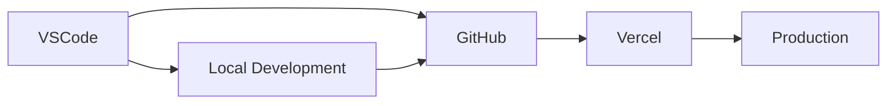

# CLAUDE.md（Next.js 個人開発用）

## ⚠️ 重要な注意事項（最優先）

- **常に日本語で回答** - すべての回答は日本語で行う。英語での回答は禁止
- **実装完了時の詳細説明は不要** - ユーザーが明示的に求めない限り、実装内容の詳細な説明や要約は出力しない
- **ソースコード変更履歴の表示禁止** - MultiEditやEditの結果として表示されるコード変更差分は不要、トークン無駄遣いなので表示しない
- **実装内容は箇条書きで簡潔に** - 何を実装したかは箇条書きで簡潔に記載する

## 1. プロジェクト概要

- **フレームワーク**: Next.js 15 (App Router), React 19, TypeScript
- **ターゲット**: Web ブラウザ（PC / モバイル対応）
- **開発言語方針**: TypeScript（型安全を優先）
- **スタイル**: Tailwind CSS v4 + PostCSS

## 2. 開発ルール

- 開発サーバ起動は **手動で `npm run dev`** を実行して確認
- 本番反映は **GitHub に手動で push → CI/CD や Vercel に反映**
- **npm の扱い**:
  - `npm ci` → lockfile に従って環境を完全再現
  - 新しい依存は必ずユーザに確認してから追加 (`npm install` や `npm add <package>`)
- **git 操作**はすべて手動
- **コード品質**:
  - ESLint / Prettier のルールに従う
  - TypeScript の strict モードを有効化し、型安全を維持
  - `npm run lint` / `npm run format` は必要に応じて実行

## 3. 許可・禁止事項

- **許可**:
  - bash: `mkdir`, `touch`, `ls`, `cat`, `find`, `echo`
  - npm: `ci`, `ls`
  - npx: `next build`, `next start`, `next dev`（手動実行前提）
- **禁止**:
  - bash: `sudo`, `pkill`, `rm -rf`
  - git 操作全般は手動以外禁止
  - 読み込み禁止: `.env`, `id_rsa`, `id_ed25519`, `**/*token*`, `**/*key*`
  - 書き込み禁止: `.env`, `**/secrets/**`

## 4. 依存関係管理

- 依存関係は lockfile に従って再現
- 新しい依存は必ずユーザに確認してから追加
- `npm ci` を基本とし、`npm install` は確認が必要な場合のみ

## 5. 開発フロー

- 開発起動: `npm run dev` を手動で実行しブラウザで動作確認
- 本番ビルド: `npm run build`
- 本番起動（ローカル確認用）: `npm run start`
- 型チェック: `npm run tsc`（必要に応じて）
- コード整形 & Lint: `npm run lint` / `npm run format`（必要に応じて）

## 6. MCP 利用方針

- 勝手に新規の MCP を導入しない

## 7. 注意事項

- 新規ライブラリ追加時は必ず確認
- 本番反映は GitHub push を経由
- TypeScript の型エラーは必ず解消してから commit
- 個人開発用なのでチーム共有は不要

# CodeBook 最新仕様書・設計書

## 📋 プロジェクト概要

### サービス名

**CodeBook** - ソースコード閲覧特化型共有プラットフォーム

### コンセプト

「ソースコードを熟読することでプログラミングを学ぶ」をコアコンセプトとした、**コード閲覧・共有に特化**した Web サービス

### 背景・課題認識

- **技術記事サイト**: 既存競合多数、新規性に乏しい
- **GitHub 等**: 操作が複雑、学習者には敷居が高い
- **既存コード共有サービス**: 個人管理用途が中心、共有・閲覧体験が不十分

### 解決アプローチ

**「ソースコードの熟読」に特化**することで、プログラミング学習の本質的価値を提供

### ターゲットユーザー

- プログラミング学習者（初級〜中級）
- 他人のコードから学びたい開発者
- 自分のコードを美しく共有したい開発者
- SNS でコードを効果的に発信したいユーザー

---

## 🎯 機能仕様

### 基本機能（MVP）

1. **コード投稿機能**

   - シンタックスハイライト付きエディター
   - タイトル、説明、言語
   - タグ機能（複数選択可能）

2. **コード閲覧機能**

   - **メイン画面の 70%をコード表示に使用**
   - サイドエリア（30%）に説明・メタ情報表示
   - フルスクリーンモード
   - ワンクリックコピー機能

3. **一覧・検索機能**

   - ホーム画面（最新・人気投稿）
   - いいねランキング
   - カテゴリ別表示
   - 言語別フィルタ
   - タグ検索

4. **エンゲージメント機能**
   - いいね機能
   - 基本的なコメント機能

### サブ機能（差別化要素）

1. **SNS 共有最適化**

   - **OGP 対応**: 未登録ユーザーも見やすいレイアウト
   - **画像生成機能**: CodeBook 透かし・ロゴ付きコード画像
   - Twitter/X、Facebook 等への最適化

2. **ユーザー機能**
   - google 認証
   - プロフィール管理
   - 投稿履歴・いいね履歴

---

## 🏗️ 技術構成

### 開発環境



### レスポンシブ設計

```typescript
const breakpoints = {
  mobile: '< 640px',
  tablet: '640px - 1024px',
  desktop: '> 1024px',
} as const;
```

### 主要画面レイアウト

#### ホーム画面

```
┌─────────────────────────────────────────────────┐
│ Header: Logo | Search | User Menu              │
├─────────────────────────────────────────────────┤
│ Hero Section: キャッチコピー + CTA               │
├─────────────────────────────────────────────────┤
│ Filter Bar: Language | Category | Sort         │
├─────────────────────────────────────────────────┤
│ ┌─────────┐ ┌─────────┐ ┌─────────┐ ┌─────────┐ │
│ │ Code    │ │ Code    │ │ Code    │ │ Code    │ │
│ │ Card 1  │ │ Card 2  │ │ Card 3  │ │ Card 4  │ │
│ └─────────┘ └─────────┘ └─────────┘ └─────────┘ │
│ ┌─────────┐ ┌─────────┐ ┌─────────┐ ┌─────────┐ │
│ │ Code    │ │ Code    │ │ Code    │ │ Code    │ │
│ │ Card 5  │ │ Card 6  │ │ Card 7  │ │ Card 8  │ │
│ └─────────┘ └─────────┘ └─────────┘ └─────────┘ │
├─────────────────────────────────────────────────┤
│ Pagination                                      │
├─────────────────────────────────────────────────┤
│ Footer                                          │
└─────────────────────────────────────────────────┘
```

#### コード詳細画面（メイン機能）

```
┌─────────────────────────────────────────────────┐
│ Header                                          │
├─────────────────────────┬───────────────────────┤
│                         │ ┌─────────────────────┐ │
│                         │ │ Title               │ │
│                         │ │ @author_name        │ │
│                         │ ├─────────────────────┤ │
│         Code            │ │ Description         │ │
│         Display         │ │                     │ │
│         Area            │ │ Lorem ipsum dolor   │ │
│         (70%)           │ │ sit amet...         │ │
│                         │ ├─────────────────────┤ │
│  [Code with syntax      │ │ Tags: #react #ts    │ │
│   highlighting,         │ ├─────────────────────┤ │
│   line numbers,         │ │ ❤️ 42 👁️ 128      │ │
│   copy button]          │ │ [Like] [Share]      │ │
│                         │ ├─────────────────────┤ │
│                         │ │ Comments (30%)      │ │
│                         │ │                     │ │
│                         │ │ └─ Comment 1        │ │
│                         │ │ └─ Comment 2        │ │
│                         │ │ [Add Comment]       │ │
└─────────────────────────┴───────────────────────┘
```

#### モバイル版コード詳細画面

```
┌─────────────────────┐
│ Header              │
├─────────────────────┤
│ Title & Author      │
├─────────────────────┤
│                     │
│     Code Display    │
│     (Full Width)    │
│                     │
├─────────────────────┤
│ Action Buttons      │
├─────────────────────┤
│ Description         │
├─────────────────────┤
│ Tags & Stats        │
├─────────────────────┤
│ Comments            │
└─────────────────────┘
```

## 🔍 開発時の注意点

### パフォーマンス考慮事項

```typescript
interface PerformanceConsiderations {
  codeHighlighting: '大きなコードファイルの動的ハイライト';
  imageGeneration: 'サーバーサイドでの画像生成処理';
  database: 'N+1クエリ問題の回避';
  caching: '適切なキャッシュ戦略';
  bundleSize: '不要なライブラリの除外';
}
```

### SEO 対策

```typescript
interface SEOStrategy {
  meta: '動的メタタグ生成';
  ogp: 'コード詳細ページのOGP最適化';
  sitemap: '動的サイトマップ生成';
  robots: '適切なロボット設定';
  structured: 'JSON-LD構造化データ';
}
```

### アクセシビリティ

```typescript
interface AccessibilityFeatures {
  keyboard: 'キーボードナビゲーション対応';
  screen: 'スクリーンリーダー対応';
  contrast: '色のコントラスト比確保';
  focus: 'フォーカス状態の明確化';
  semantic: 'セマンティックHTML使用';
}
```
